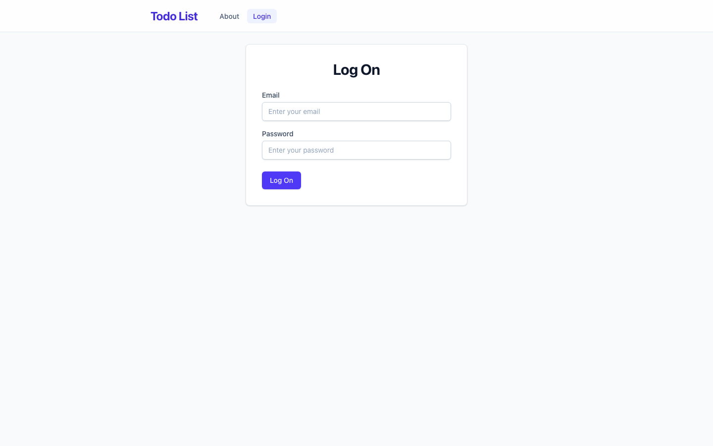
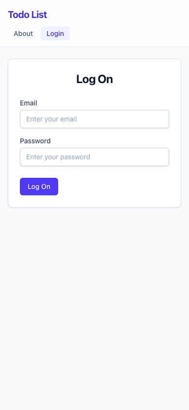
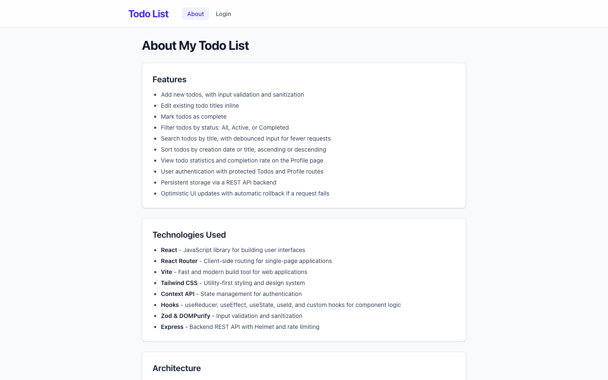
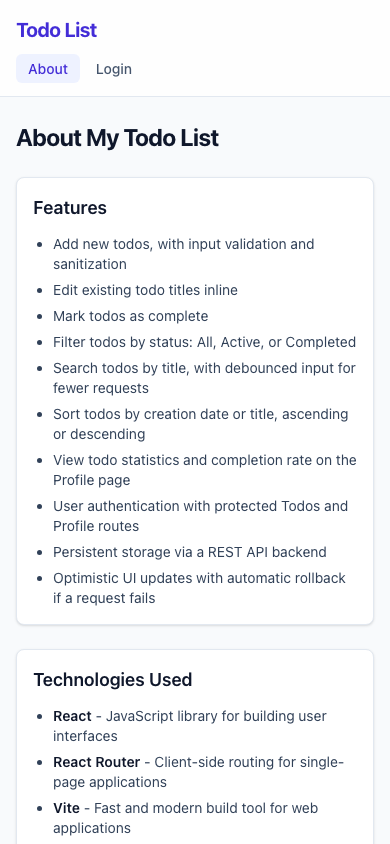
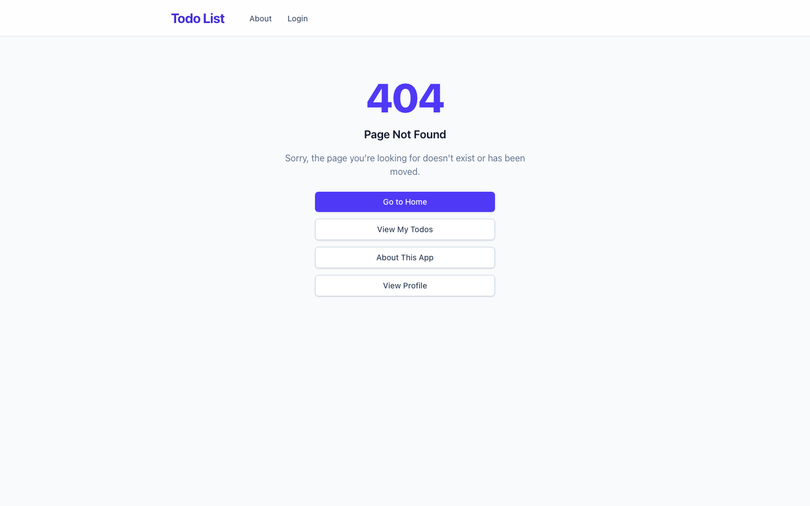
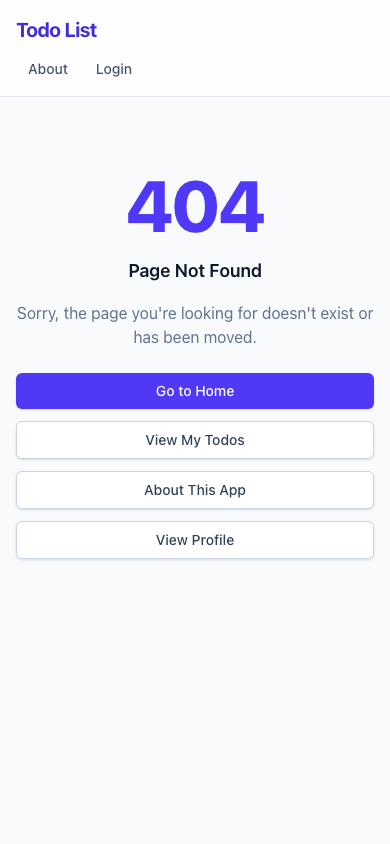

# My Todo List — React Todo Application

A responsive, full-featured todo list app built with React 19. It supports user authentication, persistent storage via a REST API, filtering, searching, sorting, pagination, and todo statistics — all wrapped in a clean Tailwind CSS interface.

## Live Demo

Not yet deployed — coming soon. (Add your Netlify/Vercel URL here once deployed.)

## Features

- Add new todos, with input validation and sanitization (Zod + DOMPurify)
- Edit existing todo titles inline
- Mark todos as complete
- Filter todos by status: All, Active, or Completed
- Search todos by title, with debounced input for fewer requests
- Sort todos by creation date or title, ascending or descending
- Paginated todo list with Previous/Next navigation
- View todo statistics and completion rate on the Profile page
- User authentication with protected `Todos` and `Profile` routes
- Optimistic UI updates with automatic rollback if a request fails
- Friendly 404 page with quick links back into the app

## Technologies Used

- **React 19** — UI library
- **React Router 7** — client-side routing and route protection
- **Vite** — dev server and build tool
- **Tailwind CSS v4** — utility-first styling, with shared component classes (`.btn-primary`, `.input-field`, `.card`, `.alert-error`, etc.) and custom design tokens defined in `src/index.css`
- **Context API + `useReducer`** — authentication and todo state management
- **Zod & DOMPurify** — input validation and sanitization
- **Express, Helmet, express-rate-limit** — local mock API server (`server/`)
- **Vitest + React Testing Library** — unit and component tests
- **ESLint** — code quality and consistency

## Screenshots

### Login Page

| Desktop | Mobile |
| --- | --- |
|  |  |

### About Page

| Desktop | Mobile |
| --- | --- |
|  |  |

### 404 Not Found Page

| Desktop | Mobile |
| --- | --- |
|  |  |

## Getting Started

### Prerequisites

- [Node.js](https://nodejs.org/) v20 or later
- npm (installed with Node.js)

### Installation

1. Clone the repository:

   ```bash
   git clone https://github.com/usinamaria/my-todo-list.git
   cd my-todo-list
   ```

2. Install dependencies:

   ```bash
   npm install
   ```

3. Copy the example environment file and adjust as needed:

   ```bash
   cp .env.example .env
   ```

4. Start the development server:

   ```bash
   npm run dev
   ```

5. Open the URL shown in your terminal (commonly `http://localhost:3001`).

## Available Scripts

- `npm run dev` — start the Vite development server
- `npm run build` — build the app for production
- `npm run preview` — preview the production build locally
- `npm run lint` — run ESLint checks
- `npm run test` — run the test suite with Vitest
- `npm run test:watch` — run tests in watch mode
- `npm run dev:api` — start the local Express mock API server (`server/index.js`)
- `npm run dev:start` — run the mock API server and Vite dev server together

## Project Structure

```
my-todo-list/
├── public/                  # Static assets served as-is
│   └── screenshots/          # Screenshots used in this README
├── server/
│   └── index.js              # Local Express mock API (Helmet, rate limiting, Zod validation)
├── src/
│   ├── components/
│   │   └── RequireAuth.jsx   # Route guard for protected pages
│   ├── contexts/
│   │   └── AuthContext.jsx   # Authentication state (login/logout, token, CSRF)
│   ├── features/
│   │   └── Todos/
│   │       ├── TodoForm.jsx        # Form for adding new todos
│   │       └── TodoList/
│   │           ├── TodoList.jsx       # Renders the todo list + pagination controls
│   │           └── TodoListItem.jsx   # Single todo row (toggle/edit/complete)
│   ├── hooks/
│   │   └── useEditableTitle.js  # Inline-edit state for todo titles
│   ├── pages/
│   │   ├── HomePage.jsx       # Redirects based on auth status
│   │   ├── LoginPage.jsx      # Login form
│   │   ├── AboutPage.jsx      # App info page
│   │   ├── TodosPage.jsx      # Main todos page (fetching, sorting, filtering, pagination)
│   │   ├── ProfilePage.jsx    # User profile + todo statistics
│   │   └── NotFoundPage.jsx   # 404 page
│   ├── reducers/
│   │   └── todoReducer.js     # Centralized state management for the todos page
│   ├── shared/                # Reusable UI building blocks
│   │   ├── Header.jsx, Navigation.jsx
│   │   ├── Checkbox.jsx, TextInputWithLabel.jsx, LoadingSpinner.jsx
│   │   └── FilterInput.jsx, SortBy.jsx, StatusFilter.jsx
│   ├── utils/
│   │   ├── errorMessages.js   # User-friendly error message helpers
│   │   ├── todoValidation.js  # Todo title validation
│   │   └── useDebounce.js     # Debounce hook for search input
│   ├── App.jsx                # Routes and top-level layout
│   ├── main.jsx                # App entry point (router, providers)
│   └── index.css               # Tailwind import, design tokens, shared component classes
├── eslint.config.js
├── vite.config.js
├── vitest.config.js
└── package.json
```

## Design Decisions

- **Tailwind CSS v4 with design tokens**: Rather than scattering one-off colors throughout components, `src/index.css` defines `primary` and `accent` color scales as CSS custom properties via `@theme`, mapped onto Tailwind's existing `indigo` and `emerald` palettes. This keeps the visual language consistent and makes a future rebrand a one-line change.
- **Shared component classes**: Common UI patterns (`.btn-primary`, `.btn-secondary`, `.input-field`, `.checkbox-field`, `.card`, `.alert-error`, `.alert-warning`) are defined once under `@layer components` and reused across pages, avoiding repetitive utility class strings.
- **Mobile-first, responsive layouts**: Pages use Tailwind's responsive variants (`sm:`, `lg:`) so forms, navigation, and lists adapt cleanly from small phone screens up to desktop widths.
- **Component extraction**: Repeated UI fragments (such as the loading spinner used across the Home, Todos, and Profile pages) are extracted into small shared components (`src/shared/`) to keep pages focused and reduce duplication.
- **Reducer-based state**: Todo list state (loading, errors, sorting, filtering, pagination) is centralized in `src/reducers/todoReducer.js` so UI components stay simple and state transitions stay predictable and testable.

## Future Improvements

- Add due dates, priorities, and tags/categories for todos
- Add drag-and-drop reordering of todos
- Persist the status filter and sort preferences per user
- Add dark mode support
- Add end-to-end tests with Playwright
- Replace the mock Express API with a production database-backed service
- Add user registration and password reset flows in the UI

## License

This project is licensed under the [MIT License](LICENSE).

## Contact

**Maria Usina**

- GitHub: [@usinamaria](https://github.com/usinamaria)
